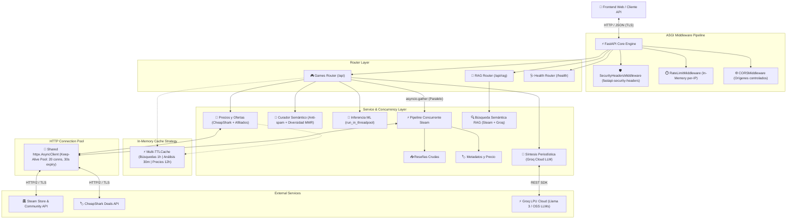

# 🎮 Game Recommended AI — Backend API 🧠

[](https://game-recommended.alejandrotg.es)
[](https://www.python.org/)
[](https://fastapi.tiangolo.com/)
[](https://pypi.org/project/fastapi-security-headers/)
[](https://docs.pytest.org/)

API REST asíncrona de alto rendimiento desarrollada con **FastAPI** que impulsa la plataforma **Game Recommended AI**. Diseñada bajo arquitectura limpia y principios de ingeniería de software para auditar, filtrar y clasificar reseñas en español de videojuegos en Steam mediante Procesamiento de Lenguaje Natural (NLP), generar síntesis editoriales con LLMs (Groq), recomendar títulos por similitud semántica (RAG) y comparar precios con plataformas de afiliados.

🚀 **[Probar la Aplicación en Producción](https://game-recommended.alejandrotg.es)** | 📚 **[Documentación OpenAPI Swagger](https://game-recommended.alejandrotg.es/docs)**

---

## 📐 Arquitectura del Sistema



---

## 🚀 Optimizaciones de Rendimiento e Ingeniería

### 1. Concurrencia Asíncrona I/O con `asyncio.gather`
El endpoint principal de análisis (`/api/analyze/{app_id}`) requiere tanto el corpus de reseñas como la ficha técnica del juego (desarrollador, géneros, precio de venta y metacritic). En lugar de llamadas secuenciales bloqueantes, el pipeline ejecuta ambas solicitudes concurrentemente con `asyncio.gather`:
* **Reducción de latencia del ~45%** en la obtención de datos externos.
* Resiliencia ante fallos parciales: si la ficha de detalles falla, el análisis de reseñas procede con valores por defecto sin interrumpir al usuario.

### 2. Connection Pooling Compartido (`httpx.Limits`)
Tanto las consultas a la API de Steam como a CheapShark reutilizan una única instancia singleton de `httpx.AsyncClient` gestionada mediante el ciclo de vida de FastAPI (`@asynccontextmanager lifespan`):
* `max_connections=20`, `max_keepalive_connections=10`, `keepalive_expiry=30s`.
* Eliminación del coste de negociación TCP y handshake TLS en cada petición entrante.

### 3. Inferencia de Machine Learning Off-Event-Loop
El modelo **Multinomial Naive Bayes con TF-IDF** realiza operaciones de cálculo numérico intensivo (CPU-bound) sobre cientos de reseñas. Para evitar bloquear el bucle de eventos (`asyncio` Event Loop) y garantizar que la API siga respondiendo a otros usuarios en milisegundos, la inferencia se delega a un threadpool de trabajadores dedicados mediante `starlette.concurrency.run_in_threadpool`.

### 4. Curación Inteligente de Reseñas (Filtro Anti-Spam + MMR)
Las reseñas de Steam contienen frecuentemente copypastes, arte ASCII, memes o textos repetitivos de una sola palabra. El módulo `curation.py`:
* Evalúa la densidad léxica y descarta textos considerados spam o de baja sustancia.
* Aplica **Maximal Marginal Relevance (MMR)** mediante similitud de coseno sobre vectores TF-IDF, seleccionando un conjunto diverso y representativo de opiniones para alimentar tanto al clasificador como al LLM.

### 5. Estrategia Multi-Caché In-Memory
Implementación de tres niveles de caché en memoria sin dependencias externas pesadas (usando `cachetools.TTLCache`):
* **Caché de Búsqueda (1 hora TTL)**: Acelera búsquedas de catálogo repetidas.
* **Caché de Análisis (30 minutos TTL)**: Devuelve clasificaciones y análisis cacheados al instante con soporte para paginación/recorte dinámico según el `limit` solicitado.
* **Caché de Precios de Afiliados (12 horas TTL)**: Minimiza peticiones a aggregadores de ofertas.

---

## 🛡️ Seguridad HTTP OWASP Hardened

El backend incorpora la librería publicada en PyPI **[`fastapi-security-headers`](https://pypi.org/project/fastapi-security-headers/)** desarrollada bajo estándares de seguridad web defensiva:

* **Preset `swagger_friendly`**: Configuración estricta de seguridad sin romper la carga dinámica de recursos CDN (Swagger UI / ReDoc).
* **Cabeceras Inyectadas en cada Response**:
  * `X-Content-Type-Options: nosniff` (Prevención de ataques MIME-sniffing).
  * `X-Frame-Options: DENY` (Protección contra Clickjacking).
  * `Strict-Transport-Security: max-age=31536000; includeSubDomains; preload` (HSTS obligatorio).
  * `Referrer-Policy: strict-origin-when-cross-origin`.
  * `Content-Security-Policy (CSP)` con directivas granularmente controladas.
  * `Permissions-Policy: geolocation=(), camera=(), microphone=(), payment=()`.
* **Rate Limiting por IP**: Protección per-IP contra abuso de peticiones y ataques de denegación de servicio (`RateLimitMiddleware`).

---

## 🌐 Referencia de Endpoints de la API REST

| Método | Endpoint | Descripción | Parámetros / Payload |
| :--- | :--- | :--- | :--- |
| `GET` | `/` | Estado base del servidor y estado del modelo ML cargado | Ninguno |
| `GET` | `/health` | Chequeo de salud del servicio, métricas de memoria, uptime y estado de caché | Ninguno |
| `GET` | `/api/search` | Búsqueda de videojuegos en tiempo real por término en el catálogo de Steam | `term` (string, min: 1) |
| `GET` | `/api/analyze/{app_id}` | Clasificación de sentimiento por IA, métricas comparativas y resumen periodístico | `app_id` (int), `limit` (int, default: 30, max: 50) |
| `GET` | `/api/games/{app_id}/badge` | Genera badge dinámico en formato SVG con el veredicto para incrustar en Markdown | `app_id` (int) |
| `GET` | `/api/games/{app_id}/affiliate-prices` | Precios en vivo, ofertas (CheapShark) y enlaces con comisión (Instant Gaming, G2A) | `app_id` (int), `name` (string) |
| `POST` | `/api/rag/recommend` | Recomendador semántico por lenguaje natural y estado de ánimo (Steam API + Groq) | JSON: `{"query": string, "top_k": int}` |

---

## 📁 Estructura del Proyecto

```text
game-recommended-backend/
├── app.py                      # Instancia FastAPI, ciclo de vida (lifespan) y middlewares
├── middleware.py               # Rate Limiting en memoria por IP
├── requirements.txt            # Dependencias de producción y testing
├── .env.development            # Variables de entorno para entorno local
├── .env.production             # Variables de entorno de producción
├── model/                      # Artefactos serializados del modelo ML
│   ├── tfidf_vectorizer.pkl    # Vectorizador TF-IDF entrenado en español
│   └── naive_bayes_model.pkl   # Clasificador Multinomial Naive Bayes
├── routers/
│   ├── __init__.py
│   ├── games.py                # Rutas de búsqueda, análisis de sentimiento, badges y precios
│   ├── health.py               # Diagnóstico de salud, memoria y uptime
│   └── rag_router.py           # Recomendador semántico por lenguaje natural
├── services/
│   ├── __init__.py
│   ├── steam.py                # Cliente HTTP asíncrono, connection pool y API de Steam
│   ├── sentiment.py            # Preprocesamiento de texto e inferencia Naive Bayes
│   ├── curation.py             # Filtro anti-spam y algoritmo de diversidad MMR
│   ├── groq_summary_service.py # Generador de resúmenes editoriales con Groq Cloud LLM
│   ├── affiliate_price_service.py # Tracker de precios CheapShark y enlaces de afiliados
│   ├── rag_service.py          # Motor RAG de recomendación semántica
│   └── cache.py                # Estrategia de almacenamiento en caché LRU (TTLCache)
└── tests/                      # Suite de pruebas automatizadas con pytest (42 tests)
    ├── conftest.py             # Fixtures de FastAPI TestClient y mocks compartidos
    ├── test_routes.py          # Pruebas integrales de endpoints de juegos
    ├── test_affiliate.py       # Pruebas de URLs de afiliados y CheapShark deals
    ├── test_security_headers.py# Verificación de cabeceras de seguridad OWASP
    ├── test_steam.py           # Pruebas del cliente asíncrono y manejo de errores Steam
    ├── test_sentiment.py       # Pruebas de limpieza y clasificación de sentimiento
    ├── test_curation.py        # Pruebas de filtrado anti-spam y diversidad MMR
    ├── test_cache.py           # Pruebas de expiración TTL y acierto/fallo de caché
    ├── test_rag.py             # Pruebas del recomendador semántico RAG
    └── test_health.py          # Pruebas del endpoint de diagnóstico /health
```

---

## 🛠️ Instalación y Puesta en Marcha

### Requisitos Previos
* **Python 3.10** o superior (probado en Python 3.11).
* Gestor de entornos (`conda` o `venv`).

### Pasos de Configuración

1. **Clonar el repositorio:**
   ```bash
   git clone https://github.com/alejandrotg-code/game-recommended-backend.git
   cd game-recommended-backend
   ```

2. **Crear y activar el entorno virtual:**
   ```bash
   # Opción Conda:
   conda create -n game-recommended python=3.11 -y
   conda activate game-recommended

   # Opción venv:
   python -m venv venv
   source venv/bin/activate  # En Windows: .\venv\Scripts\activate
   ```

3. **Instalar dependencias:**
   ```bash
   pip install -r requirements.txt
   ```

4. **Configurar variables de entorno:**
   Crea o edita el archivo `.env.development`:
   ```env
   ENV=development
   CORS_ORIGINS=http://localhost:5173,https://game-recommended.alejandrotg.es
   RATE_LIMIT=60
   RATE_WINDOW=60
   GROQ_API_KEY=tu_groq_api_key_opcional
   ```

5. **Iniciar el servidor de desarrollo:**
   ```bash
   uvicorn app:app --reload --port 8000
   ```

6. **Explorar la documentación interactiva:**
   * **Swagger UI:** [http://localhost:8000/docs](http://localhost:8000/docs)
   * **ReDoc:** [http://localhost:8000/redoc](http://localhost:8000/redoc)

---

## 🧪 Suite de Pruebas Automatizadas

El proyecto cuenta con una cobertura completa de pruebas unitarias y de integración:

```bash
# Ejecutar toda la suite de pruebas
pytest -v

# Ejecutar con reporte detallado
pytest -v --durations=10
```

```text
============================= test session starts =============================
collected 42 items

tests/test_affiliate.py::test_build_affiliate_urls PASSED                [  2%]
tests/test_affiliate.py::test_fetch_cheapshark_deal_success PASSED       [  4%]
tests/test_affiliate.py::test_fetch_cheapshark_deal_error_graceful PASSED [  7%]
tests/test_affiliate.py::test_get_affiliate_prices_caching PASSED        [  9%]
tests/test_affiliate.py::test_affiliate_prices_endpoint PASSED           [ 11%]
tests/test_cache.py (8 tests) ........................................   [ 30%]
tests/test_curation.py (3 tests) .....................................   [ 38%]
tests/test_health.py (4 tests) .......................................   [ 47%]
tests/test_rag.py (4 tests) ..........................................   [ 57%]
tests/test_routes.py (6 tests) .......................................   [ 71%]
tests/test_security_headers.py (3 tests) .............................   [ 78%]
tests/test_sentiment.py (2 tests) ....................................   [ 83%]
tests/test_steam.py (7 tests) ........................................   [100%]

======================== 42 passed in 3.65s ========================
```

---

## 👨‍💻 Autor

**Alejandro Tacoronte González**  
*Backend Software Engineer*

* 🌐 **Portfolio Web:** [portfolio.alejandrotg.es](https://portfolio.alejandrotg.es/)
* 💼 **LinkedIn:** [linkedin.com/in/alejandrotacoronte](https://www.linkedin.com/in/alejandrotacoronte/)
* 🐙 **GitHub:** [github.com/alejandrotg-code](https://github.com/alejandrotg-code)
